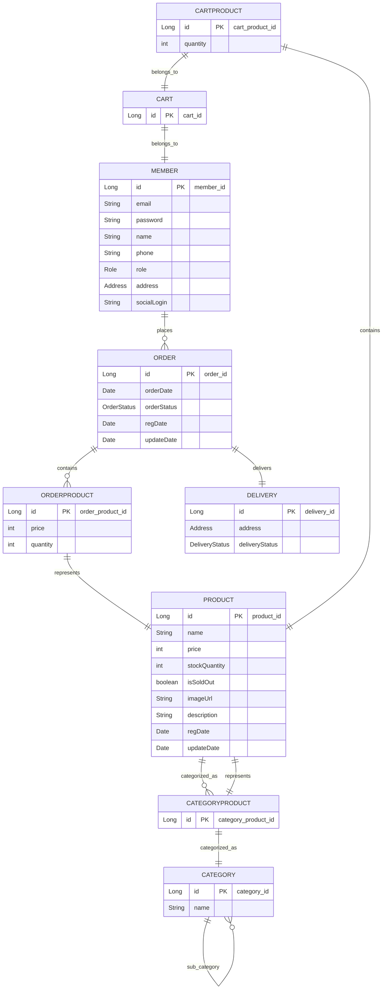

# TestMall

---
## 1. 프로젝트 목표
### 1. 1차 목표
1. 사용자가 회원가입이 가능하고 로그인이 가능해야 한다.
2. 로셜로그인이 가능해야 한다.
3. 관리자가 상품을 등록할 수 있어야 한다.
4. 사용자가 상품을 구매할 수 있어야 한다.
5. 사용자가 상품을 장바구니에 담을 수 있어야 한다.
6. 사용자가 게시판을 통해 질문을 할 수 있어야 한다.

## 2. 2차 목표
1. 배치를 통해 상품 배송이 완료된 후 일정시간이 지나면 상품을 자동으로 구매확정 처리한다.

## 3. 3차 목표
1. aws를 통해 배포한다.

---
## 2. ERD

