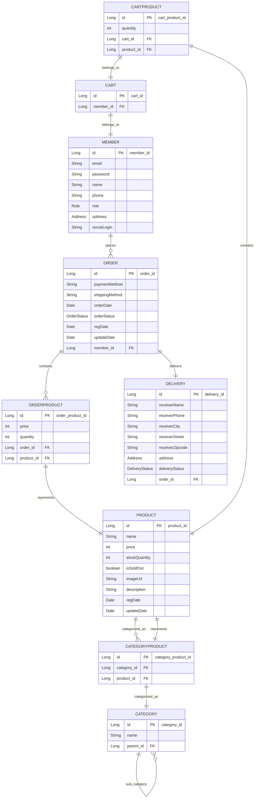

# TestMall

---
## 1. 프로젝트 목표
### 1. 1차 목표
1. 사용자가 회원가입이 가능하고 로그인이 가능해야 한다.
2. 로셜로그인이 가능해야 한다.
3. 관리자가 상품을 등록할 수 있어야 한다.
4. 사용자가 상품을 구매할 수 있어야 한다.
5. 사용자가 상품을 장바구니에 담을 수 있어야 한다.
6. 사용자가 게시판을 통해 질문을 할 수 있어야 한다.

## 2. 2차 목표
1. 배치를 통해 상품 배송이 완료된 후 일정시간이 지나면 상품을 자동으로 구매확정 처리한다.

## 3. 3차 목표
1. aws를 통해 배포한다.

---
## 2. ERD

---
## 3. API 명세서
### 1. 회원관련
| Method |      Path      |   Description    |
|:------:|:--------------:|:----------------:|
|  POST  |    /signup     |    회원가입을 한다.     |
|  POST  |     /login     |     로그인을 한다.     |
| PATCH  | /member/update |   회원정보를 수정한다.    |
|  GET   |  /memberlist   |   회원목록을 가져온다.    |
|  POST  |  /passwordCheck   |   비밀번호 유효성 검사.   |
|  GET   |  /kakaoLoginSuccess   | 카카오로 로그인 했을때 처리. |

### 2. 상품관련
| Method |     Path      |      Description      |
|:------:|:-------------:|:---------------------:|
|  POST  | /product/save |       상품을 등록한다.       |
|  GET   | /productlist  |      상품목록을 제공한다.      |
|  GET   | /product/{id} |   특정 상품의 정보를 제공한다.    |
|  POST  |   /category   |     카테고리를 등록합니다.      |
|  GET   |  /categories  |    카테고리 목록을 제공합니다.    |
|  POST  |  /cart/add    |   장바구니에 상품을 등록합니다.    |
|  GET   |  /cart/products/{email}   | 특정회원의 장바구니 목록을 제공합니다. |
| DELETE | /cart/delete/{productName}/{userEmail}  | 특정회원의 장바구니 상품을 삭제합니다. |

